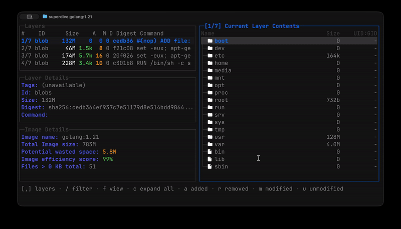

# Superdive (dive fork)

**A tool for exploring a Docker image, layer contents, and discovering ways to shrink the size of your Docker/OCI image.**



## Installation

### bun/npm (recommended)

```bash
bun install -g superdive
npm install -g superdive
```

### From source

```bash
git clone https://github.com/dukaev/superdive.git
cd superdive
go build -o superdive ./cmd/dive
```

## Usage

To analyze a Docker image simply run superdive with an image tag/id/digest:
```bash
superdive <your-image-tag>
```

Or if you want to build your image then jump straight into analyzing it:
```bash
superdive build -t <some-tag> .
```

Additionally you can run this in your CI pipeline to ensure you're keeping wasted space to a minimum (this skips the UI):
```bash
CI=true superdive <your-image>
```

## Basic Features

**Show Docker image contents broken down by layer**

As you select a layer on the left, you are shown the contents of that layer combined with all previous layers on the right. Also, you can fully explore the file tree with the arrow keys.

**Indicate what's changed in each layer**

Files that have changed, been modified, added, or removed are indicated in the file tree. This can be adjusted to show changes for a specific layer, or aggregated changes up to this layer.

**Estimate "image efficiency"**

The lower left pane shows basic layer info and an experimental metric that will guess how much wasted space your image contains. This might be from duplicating files across layers, moving files across layers, or not fully removing files. Both a percentage "score" and total wasted file space is provided.

**Quick build/analysis cycles**

You can build a Docker image and do an immediate analysis with one command:
```bash
superdive build -t some-tag .
```

You only need to replace your `docker build` command with the same `superdive build` command.

**CI Integration**

Analyze an image and get a pass/fail result based on the image efficiency and wasted space. Simply set `CI=true` in the environment when invoking any valid superdive command.

**Multiple Image Sources and Container Engines Supported**

With the `--source` option, you can select where to fetch the container image from:
```bash
superdive <your-image> --source <source>
```
or
```bash
superdive <source>://<your-image>
```

With valid `source` options as such:
- `docker`: Docker engine (the default option)
- `docker-archive`: A Docker Tar Archive from disk
- `podman`: Podman engine (linux only)

## CI Integration

When running superdive with the environment variable `CI=true` then the UI will be bypassed and will instead analyze your docker image, giving it a pass/fail indication via return code. Currently there are three metrics supported via a `.dive-ci` file that you can put at the root of your repo:
```yaml
rules:
  # If the efficiency is measured below X%, mark as failed.
  # Expressed as a ratio between 0-1.
  lowestEfficiency: 0.95

  # If the amount of wasted space is at least X or larger than X, mark as failed.
  # Expressed in B, KB, MB, and GB.
  highestWastedBytes: 20MB

  # If the amount of wasted space makes up for X% or more of the image, mark as failed.
  # Note: the base image layer is NOT included in the total image size.
  # Expressed as a ratio between 0-1; fails if the threshold is met or crossed.
  highestUserWastedPercent: 0.20
```
You can override the CI config path with the `--ci-config` option.

## License

MIT
